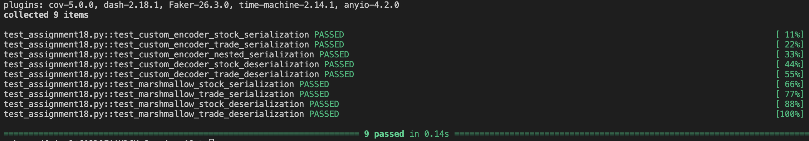

# JSON Serialization

This project explores different methods of JSON serialization and deserialization in Python, focusing on handling complex data types and integrating schema validation. Key features include custom serialization for objects, type preservation, and Marshmallow-based schema validation.

## Features

- **Custom JSON Encoding/Decoding**: Serialization of `Stock` and `Trade` objects with type preservation.
- **Date and Decimal Support**: Handles `date`, `datetime`, and `Decimal` types during serialization.
- **Schema Validation with Marshmallow**: Uses Marshmallow schemas for validating serialized data.
- **Comprehensive Test Suite**: Includes unit tests for each function using `pytest`.

---

## Classes and Functions

### `Stock` and `Trade` Classes
These classes define stock and trade data, encapsulating attributes such as `symbol`, `date`, `open`, `high`, `low`, and `volume` for `Stock`, and `symbol`, `timestamp`, `order`, `price`, `volume`, and `commission` for `Trade`.

```python
class Stock:
    def __init__(self, symbol, date, open, high, low, close, volume):
        # Initializes a Stock object
        ...

class Trade:
    def __init__(self, symbol, timestamp, order, price, volume, commission):
        # Initializes a Trade object
        ...
```

### Custom JSON Encoder and Decoder
#### `CustomEncoder`
The `CustomEncoder` class customizes JSON serialization, handling `Decimal`, `Stock`, and `Trade` objects.

```python
class CustomEncoder(json.JSONEncoder):
    def default(self, obj):
        if isinstance(obj, Decimal):
            return str(obj)
        elif isinstance(obj, (Stock, Trade)):
            result = obj.__dict__.copy()
            result['__type__'] = obj.__class__.__name__
            return result
        elif isinstance(obj, (date, datetime)):
            return obj.isoformat()
        return super().default(obj)
```

#### `custom_decoder`
The `custom_decoder` function deserializes JSON objects back into `Stock` or `Trade` instances.

```python
def custom_decoder(obj):
    if '__type__' in obj:
        if obj['__type__'] == 'Stock':
            obj['date'] = datetime.strptime(obj['date'], '%Y-%m-%d').date()
            obj = {k: Decimal(v) if k in ['open', 'high', 'low', 'close'] else v for k, v in obj.items()}
            return Stock(**obj)
        elif obj['__type__'] == 'Trade':
            obj['timestamp'] = datetime.fromisoformat(obj['timestamp'])
            obj['price'] = Decimal(obj['price'])
            obj['commission'] = Decimal(obj['commission'])
            return Trade(**obj)
    return obj
```

### Marshmallow Schema Implementation
Using Marshmallow, we define schemas for `Stock` and `Trade` objects to enable validated serialization and deserialization.

```python
class StockSchema(Schema):
    symbol = fields.Str()
    date = fields.Str()
    open = fields.Decimal()
    high = fields.Decimal()
    low = fields.Decimal()
    close = fields.Decimal()
    volume = fields.Int()

class TradeSchema(Schema):
    symbol = fields.Str()
    timestamp = fields.DateTime()
    order = fields.Str()
    price = fields.Decimal()
    volume = fields.Int()
    commission = fields.Decimal()
```

#### `serialize_with_marshmallow` and `deserialize_with_marshmallow`
These functions use Marshmallow schemas to handle serialization and deserialization.

```python
def serialize_with_marshmallow(obj):
    if isinstance(obj, Stock):
        return StockSchema().dumps(obj, cls=CustomEncoder)
    elif isinstance(obj, Trade):
        return TradeSchema().dumps(obj, cls=CustomEncoder)
    raise TypeError(f"Object of type {type(obj)} is not supported")

def deserialize_with_marshmallow(json_str, schema):
    return schema.loads(json_str)
```

---

## Testing

The project includes a test suite using `pytest` to validate all major functionalities, from encoding and decoding to Marshmallow-based schema handling. These tests confirm correct JSON serialization and deserialization, as well as type and data integrity.

### Test Functions

Below is a summary of each test function, along with the specific functionality it verifies:

1. **`test_custom_encoder_stock_serialization`**  
   - **Purpose**: Verifies that `Stock` objects are correctly serialized using the `CustomEncoder`.
   - **Tested Elements**: Checks that the serialized JSON contains expected fields, like `"symbol": "TSLA"` and `"date": "2018-11-22"`.

2. **`test_custom_encoder_trade_serialization`**  
   - **Purpose**: Ensures that `Trade` objects are correctly serialized using the `CustomEncoder`.
   - **Tested Elements**: Confirms that fields like `"symbol": "TSLA"` and `"timestamp": "2018-11-22T10:05:12"` are accurately represented in the JSON output.

3. **`test_custom_encoder_nested_serialization`**  
   - **Purpose**: Tests that a nested dictionary with both `Stock` and `Trade` objects serializes correctly.
   - **Tested Elements**: Checks for JSON elements `"quotes"` and `"trades"` to verify successful nested serialization.

4. **`test_custom_decoder_stock_deserialization`**  
   - **Purpose**: Validates that serialized JSON of `Stock` objects is accurately deserialized using `custom_decoder`.
   - **Tested Elements**: Asserts that deserialized objects are instances of `Stock` and retain correct attributes (e.g., `symbol == 'TSLA'`).

5. **`test_custom_decoder_trade_deserialization`**  
   - **Purpose**: Ensures that serialized JSON of `Trade` objects deserializes correctly.
   - **Tested Elements**: Confirms that deserialized objects are instances of `Trade` with correct field values (e.g., `symbol == 'TSLA'`).

6. **`test_marshmallow_stock_serialization`**  
   - **Purpose**: Tests the Marshmallow-based serialization of `Stock` objects.
   - **Tested Elements**: Verifies that the serialized JSON output includes expected values (e.g., `"symbol": "TSLA"` and `"date": "2018-11-22"`).

7. **`test_marshmallow_trade_serialization`**  
   - **Purpose**: Checks the Marshmallow-based serialization of `Trade` objects.
   - **Tested Elements**: Ensures that values like `"symbol": "TSLA"` and `"timestamp": "2018-11-22T10:05:12"` are present in the JSON output.

8. **`test_marshmallow_stock_deserialization`**  
   - **Purpose**: Verifies that Marshmallow can deserialize a JSON string back into a `Stock` object.
   - **Tested Elements**: Checks that deserialized data contains correct fields and values, such as `symbol == 'TSLA'`.

9. **`test_marshmallow_trade_deserialization`**  
   - **Purpose**: Tests Marshmallow’s deserialization for `Trade` objects.
   - **Tested Elements**: Ensures that fields like `symbol == 'TSLA'` are preserved after deserialization.

### Running Tests

To run the tests, use the following command:

```bash
pytest -v
```

### Snapshot of testing the code

